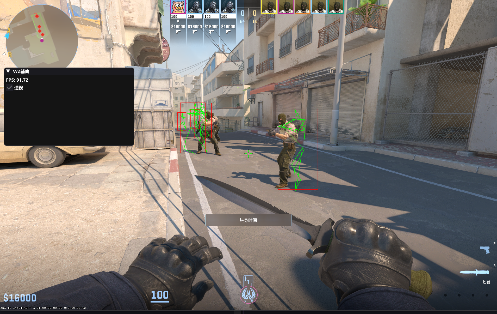

## System Overview

This project is an external ESP tool for Counter-Strike 2 (CS2). It uses DMA hardware to safely and quickly read game memory, and draws player data on the screen with low delay.

This project runs at 100 FPS on a 35T (Screamer) device.

##
Please update the offset manually

## --------------------------------------------

